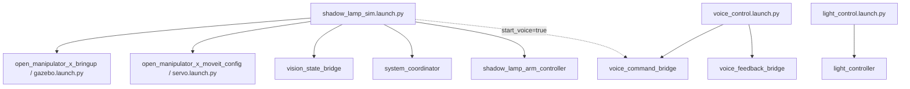

# 智能无影灯系统架构 / ROS2 节点通信图整理稿

本文档用于交付绘图 agent，重点描述当前代码中的 ROS2 节点、话题、消息类型、发布/订阅方向、服务调用关系和 launch 组织方式。绘图时应以“节点通信图”为主，不做美工展开。

建议最终输出为 4 张图：

1. ROS2 节点总通信图
2. 感知到机械臂控制主链路图
3. 语音到灯光与反馈链路图
4. Launch 启动组织图

## 1. 绘图总原则

- 图中节点名优先使用当前代码中的 ROS2 node name。
- 节点之间的箭头必须标注话题名和消息类型。
- 定时发布、事件触发发布、服务调用要用不同线型或不同标注区分。
- 外部系统如 `MoveIt Servo`、`OpenMANIPULATOR-X`、`WS2812B SPI driver` 可以画成“外部运行时 / 硬件执行层”。
- 需要明确 `voice_feedback_bridge` 是独立反馈节点，不要画成 `voice_command_bridge` 的内部函数。

## 2. 当前 ROS2 节点清单

| 节点名 | Package | Executable | 主要职责 | 当前状态 |
|---|---|---|---|---|
| `vision_state_bridge` | `vision_perception` | `vision_state_bridge` | 从视觉运行时读取手部、阴影、姿态状态并发布视觉消息 | 已实现 |
| `voice_command_bridge` | `voice_control` | `voice_command_bridge` | 从语音运行时读取确认后的语音命令并发布命令消息 | 已实现 |
| `voice_feedback_bridge` | `voice_control` | `voice_feedback_bridge` | 订阅反馈文本并调用语音/文本反馈运行时 | 已实现 |
| `system_coordinator` | `system_coordinator` | `system_coordinator` | 订阅视觉与语音消息，输出系统模式、机械臂命令、灯光命令和语音反馈 | 已实现 |
| `shadow_lamp_arm_controller` | `arm_control` | `arm_controller` | 将高层机械臂命令转换为 MoveIt Servo 的关节 jog 消息 | 主仿真 launch 名称 |
| `arm_controller` | `arm_control` | `arm_controller` | 与上面同一可执行文件，在独立 launch 中使用的节点名 | 独立 launch 名称 |
| `light_controller` | `light_control` | `light_controller` | 将灯光命令转换为 WS2812B 帧并通过 SPI 或日志驱动输出 | 已实现 |
| `servo_node` | `open_manipulator_x_moveit_config` | 外部 launch | 接收 `JointJog`，驱动 MoveIt Servo | 外部依赖 |

## 3. 当前话题与服务清单

### 3.1 ROS2 Topics

| Topic | Message Type | Publisher | Subscriber | 触发方式 | 图中含义 |
|---|---|---|---|---|---|
| `/vision/state` | `shadow_lamp_interfaces/VisionState` | `vision_state_bridge` | `system_coordinator` | 0.5s 定时发布 | 视觉感知状态 |
| `/voice/command` | `shadow_lamp_interfaces/VoiceCommand` | `voice_command_bridge` | `system_coordinator` | 0.1s 轮询，确认命令后发布 | 用户语音命令 |
| `/system/mode` | `shadow_lamp_interfaces/SystemMode` | `system_coordinator` | 当前代码未见订阅者 | 1.0s 定时发布 | 系统模式广播 |
| `/arm/command` | `shadow_lamp_interfaces/ArmCommand` | `system_coordinator` | `shadow_lamp_arm_controller` 或 `arm_controller` | 视觉状态触发，且需要跟踪时发布 | 高层机械臂跟踪命令 |
| `/light/command` | `shadow_lamp_interfaces/LightCommand` | `system_coordinator` | `light_controller` | 语音灯光命令触发 | 灯光开关、亮度、冷暖光命令 |
| `/voice/feedback` | `std_msgs/String` | `system_coordinator` | `voice_feedback_bridge` | 姿态提醒触发 | 语音或文本反馈内容 |
| `/servo_node/delta_joint_cmds` | `control_msgs/JointJog` | `shadow_lamp_arm_controller` | `servo_node` | 收到 `/arm/command` 后发布 | MoveIt Servo 关节速度命令 |

### 3.2 ROS2 Services

| Service | Type | Client | Server | 图中含义 |
|---|---|---|---|---|
| `/servo_node/start_servo` | `std_srvs/Trigger` | `shadow_lamp_arm_controller` | `servo_node` | 机械臂控制节点启动 MoveIt Servo |

## 4. 图一：ROS2 节点总通信图

### 4.1 这张图的目的

一张图展示所有 ROS2 节点和核心 Topic / Service。建议把 `system_coordinator` 放在中心，感知输入放左侧，执行输出放右侧，反馈链路放下方。

### 4.2 建议节点布局

左侧输入节点：

- `vision_state_bridge`
- `voice_command_bridge`

中心决策节点：

- `system_coordinator`

右侧执行节点：

- `shadow_lamp_arm_controller`（或独立 launch 下的 `arm_controller`）
- `light_controller`
- `servo_node`

下方反馈节点：

- `voice_feedback_bridge`

外部硬件/运行时：

- `D435 / camera runtime`
- `USB mic / speech runtime`
- `OpenMANIPULATOR-X`
- `WS2812B / SPI`
- `TTS or terminal fallback`

### 4.3 建议箭头关系

- `D435 / camera runtime -> vision_state_bridge`
  - 标注：`capture_once()`
- `vision_state_bridge -> system_coordinator`
  - 标注：`/vision/state : VisionState`
- `USB mic / speech runtime -> voice_command_bridge`
  - 标注：`capture_once()`
- `voice_command_bridge -> system_coordinator`
  - 标注：`/voice/command : VoiceCommand`
- `system_coordinator -> /system/mode`
  - 标注：`SystemMode, 1Hz`
- `system_coordinator -> shadow_lamp_arm_controller`
  - 标注：`/arm/command : ArmCommand`
- `shadow_lamp_arm_controller -> servo_node`
  - 标注：`/servo_node/delta_joint_cmds : JointJog`
- `shadow_lamp_arm_controller -> servo_node`
  - 标注：`/servo_node/start_servo : Trigger service`
- `servo_node -> OpenMANIPULATOR-X`
  - 标注：`MoveIt Servo / joint controllers`
- `system_coordinator -> light_controller`
  - 标注：`/light/command : LightCommand`
- `light_controller -> WS2812B / SPI`
  - 标注：`Ws2812Frame -> SpiWs2812Driver`
- `system_coordinator -> voice_feedback_bridge`
  - 标注：`/voice/feedback : std_msgs/String`
- `voice_feedback_bridge -> TTS or terminal fallback`
  - 标注：`speak_or_print()`

### 4.4 建议 Mermaid 草图

```mermaid
flowchart LR
  Camera[D435 / camera runtime] -->|capture_once| Vision[vision_state_bridge]
  Mic[USB mic / speech runtime] -->|capture_once| VoiceCmd[voice_command_bridge]

  Vision -->|/vision/state\nVisionState| Coordinator[system_coordinator]
  VoiceCmd -->|/voice/command\nVoiceCommand| Coordinator

  Coordinator -->|/system/mode\nSystemMode, 1Hz| Mode[(system mode broadcast)]
  Coordinator -->|/arm/command\nArmCommand| Arm[shadow_lamp_arm_controller\n(or arm_controller)]
  Coordinator -->|/light/command\nLightCommand| Light[light_controller]
  Coordinator -->|/voice/feedback\nstd_msgs/String| Feedback[voice_feedback_bridge]

  Arm -->|/servo_node/start_servo\nTrigger service| Servo[servo_node / MoveIt Servo]
  Arm -->|/servo_node/delta_joint_cmds\nJointJog| Servo
  Servo -->|joint controllers| Manipulator[OpenMANIPULATOR-X]

  Light -->|Ws2812Frame / SPI| LED[WS2812B]
  Feedback -->|speak_or_print| UserFeedback[TTS / terminal fallback]
```

## 5. 图二：感知到机械臂控制主链路图

### 5.1 这张图的目的

突出当前最核心的闭环：视觉检测手部与阴影，系统协调模块生成机械臂 yaw/pitch 命令，再由 MoveIt Servo 驱动机械臂调整灯头方向。

### 5.2 建议节点顺序

`D435 / camera runtime -> vision_state_bridge -> /vision/state -> system_coordinator -> /arm/command -> shadow_lamp_arm_controller（或 arm_controller） -> /servo_node/delta_joint_cmds -> servo_node -> OpenMANIPULATOR-X`

### 5.3 每段箭头标注

- `D435 / camera runtime -> vision_state_bridge`
  - `视觉运行时采集：手部、阴影、姿态`
- `vision_state_bridge -> system_coordinator`
  - `/vision/state : VisionState`
  - 字段重点：`hand_detected`、`hand_center_x/y`、`shadow_detected`、`shadow_center_x/y`、`needs_relight`、`posture_ok`、`posture_issue`
- `system_coordinator -> shadow_lamp_arm_controller`
  - `/arm/command : ArmCommand`
  - 字段重点：`mode`、`follow_enabled`、`yaw`、`pitch`
- `shadow_lamp_arm_controller -> servo_node`
  - `/servo_node/delta_joint_cmds : JointJog`
  - 作用：将 `yaw/pitch` 映射成关节速度
- `shadow_lamp_arm_controller -> servo_node`
  - `/servo_node/start_servo : Trigger service`
  - 作用：确保 MoveIt Servo 已启动

### 5.4 当前算法说明

- `system_coordinator` 在收到 `/vision/state` 后调用 `compute_arm_command_from_vision()`。
- 当 `tracking_enabled=True` 且检测到需要补光时，发布 `/arm/command`。
- `shadow_lamp_arm_controller` 调用 `arm_command_to_joint_jog_spec()`，把高层 `yaw/pitch` 转成 `JointJog`。
- 当前机械臂控制是方向修正型控制，不是完整末端位姿规划闭环。

## 6. 图三：语音到灯光与反馈链路图

### 6.1 这张图的目的

突出人机交互链路：语音命令可以切换跟踪模式，也可以触发灯光命令；姿态提醒通过反馈话题进入语音/文本输出。

### 6.2 语音命令输入链路

建议节点顺序：

`USB mic / speech runtime -> voice_command_bridge -> /voice/command -> system_coordinator`

箭头标注：

- `USB mic / speech runtime -> voice_command_bridge`
  - `Vosk / wake word / fixed command`
- `voice_command_bridge -> system_coordinator`
  - `/voice/command : VoiceCommand`
  - 字段重点：`wake_word`、`command`、`confidence`、`raw_text`、`confirmed`

### 6.3 跟踪模式控制链路

建议节点顺序：

`/voice/command -> system_coordinator -> /system/mode`

命令映射：

| VoiceCommand.command | system_coordinator 行为 |
|---|---|
| `enable_tracking` | `tracking_enabled=True`，后续视觉状态可触发 `/arm/command` |
| `disable_tracking` | `tracking_enabled=False`，停止跟踪输出 |

### 6.4 灯光控制链路

建议节点顺序：

`/voice/command -> system_coordinator -> /light/command -> light_controller -> WS2812B / SPI`

命令映射：

| VoiceCommand.command | LightCommand 输出 |
|---|---|
| `light_on` | `enabled=True`，保持当前模式、亮度、色温 |
| `light_off` | `enabled=False` |
| `warm_light_mode` | `mode=warm_light_mode`，`color_temperature=3200` |
| `cool_light_mode` | `mode=cool_light_mode`，`color_temperature=6500` |
| `brightness_up` | 亮度增加 `0.1`，上限 `1.0` |
| `brightness_down` | 亮度减少 `0.1`，下限 `0.0` |
| `max_brightness` | `brightness=1.0` |
| `medium_brightness` | `brightness=0.5` |
| `min_brightness` | `brightness=0.1` |

灯控节点处理：

- `light_controller` 订阅 `/light/command`。
- 根据 `mode` 选择基础 RGB：`warm_light_mode`、`cool_light_mode`、`tracking`、`shadow`、`error`、`idle`。
- 根据 `brightness` 缩放 RGB。
- 生成 `Ws2812Frame`，通过 `SpiWs2812Driver` 输出到 WS2812B。
- SPI 参数：`spi_bus=1`、`spi_device=0`、`spi_hz=2400000`、默认 `led_count=60`。
- 如果 SPI 初始化失败，回退到日志驱动。

### 6.5 姿态提醒反馈链路

建议节点顺序：

`/vision/state -> system_coordinator -> /voice/feedback -> voice_feedback_bridge -> TTS or terminal fallback`

箭头标注：

- `/vision/state -> system_coordinator`
  - `posture_ok / posture_issue`
- `system_coordinator -> voice_feedback_bridge`
  - `/voice/feedback : std_msgs/String`
- `voice_feedback_bridge -> TTS or terminal fallback`
  - `speak_or_print()`

当前提醒逻辑：

- `system_coordinator` 当前只保留 `shoulder_tilt` 作为触发姿态问题。
- 姿态问题持续达到配置时间后发布反馈。
- 反馈内容不通过 `/voice/command` 回流，而是走独立 `/voice/feedback` 话题。

## 7. 图四：Launch 启动组织图

### 7.1 这张图的目的

说明系统运行时哪些节点由哪个 launch 拉起，哪些属于外部 OpenMANIPULATOR launch，哪些是独立 launch。

### 7.2 主仿真启动：`shadow_lamp_sim.launch.py`

主 launch 位于：`system_coordinator/launch/shadow_lamp_sim.launch.py`

启动内容：

- Include `open_manipulator_x_bringup/launch/gazebo.launch.py`
  - 参数：`start_rviz`
- Include `open_manipulator_x_moveit_config/launch/servo.launch.py`
  - 参数：`use_sim=true`
- Node `vision_state_bridge`
- Node `system_coordinator`
  - 参数：`tracking_enabled_default=True`
- Node `shadow_lamp_arm_controller`
- Conditional Node `voice_command_bridge`
  - 条件：`start_voice=true`

注意：

- 当前 `shadow_lamp_sim.launch.py` 没有直接启动 `light_controller`。
- 当前 `shadow_lamp_sim.launch.py` 没有直接启动 `voice_feedback_bridge`。
- 如需完整语音反馈和灯控演示，应同时启动对应独立 launch 或扩展主 launch。

### 7.3 独立 launch

| Launch 文件 | 启动节点 | 用途 |
|---|---|---|
| `vision_perception.launch.py` | `vision_state_bridge` | 单独启动视觉桥接 |
| `voice_control.launch.py` | `voice_command_bridge`、`voice_feedback_bridge` | 启动语音命令与语音反馈 |
| `arm_control.launch.py` | `arm_controller` | 单独启动机械臂控制桥接 |
| `light_control.launch.py` | `light_controller` | 单独启动灯控节点 |
| `system_coordinator.launch.py` | `system_coordinator` | 单独启动系统协调节点 |

### 7.4 建议 Mermaid 草图



## 8. 绘图时需要特别避免的错误

- 不要遗漏 `/voice/feedback`，它是当前姿态提醒输出链路的一部分。
- 不要把 `voice_feedback_bridge` 画成 `voice_command_bridge` 的内部模块，它是独立 ROS2 节点。
- 不要把 `/system/mode` 画成有明确订阅者；当前代码里只看到发布者。
- 不要把 `light_controller` 画进 `shadow_lamp_sim.launch.py` 的默认启动链，当前主 launch 未直接启动它。
- 不要把 `voice_feedback_bridge` 画进 `shadow_lamp_sim.launch.py` 的默认启动链，当前主 launch 未直接启动它。
- 不要忽略机械臂节点名存在两种运行态：主仿真 launch 下是 `shadow_lamp_arm_controller`，独立 launch 下是 `arm_controller`。
- 不要把机械臂控制画成末端位姿规划，它当前是 `ArmCommand yaw/pitch -> JointJog` 的速度映射。
- 不要把灯控画成纯日志输出；当前默认会尝试 `SpiWs2812Driver`，失败后才回退日志驱动。

## 9. 可直接交给绘图 agent 的一句话摘要

请绘制一个以 `system_coordinator` 为中心的 ROS2 节点通信图：左侧由 `vision_state_bridge` 发布 `/vision/state`、`voice_command_bridge` 发布 `/voice/command`；中心节点根据视觉与语音状态发布 `/system/mode`、`/arm/command`、`/light/command` 和 `/voice/feedback`；右侧由 `shadow_lamp_arm_controller` 通过 `/servo_node/delta_joint_cmds` 与 `/servo_node/start_servo` 驱动 MoveIt Servo 和 OpenMANIPULATOR-X，由 `light_controller` 通过 SPI 驱动 WS2812B；下方由 `voice_feedback_bridge` 订阅 `/voice/feedback` 输出 TTS 或终端反馈。
